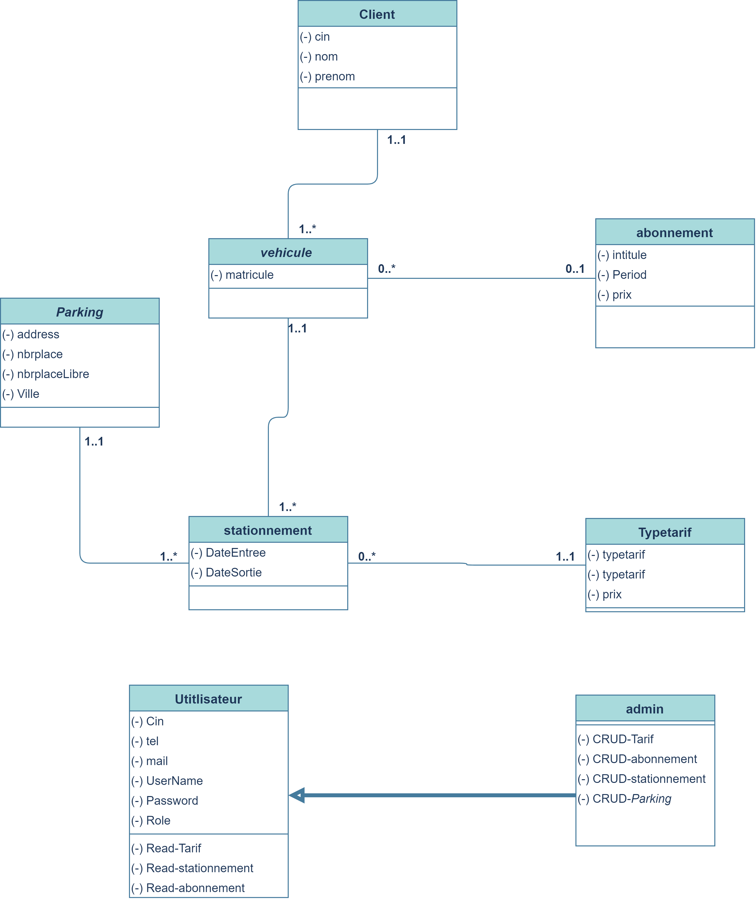
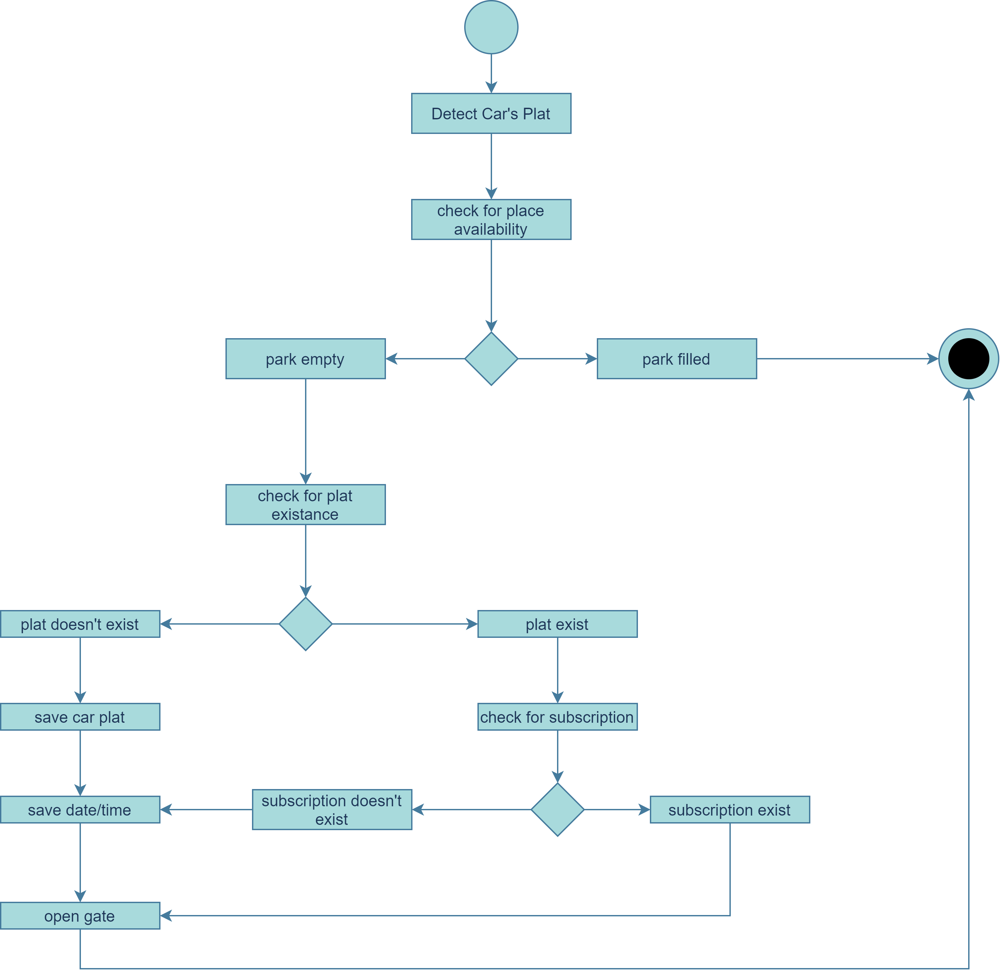
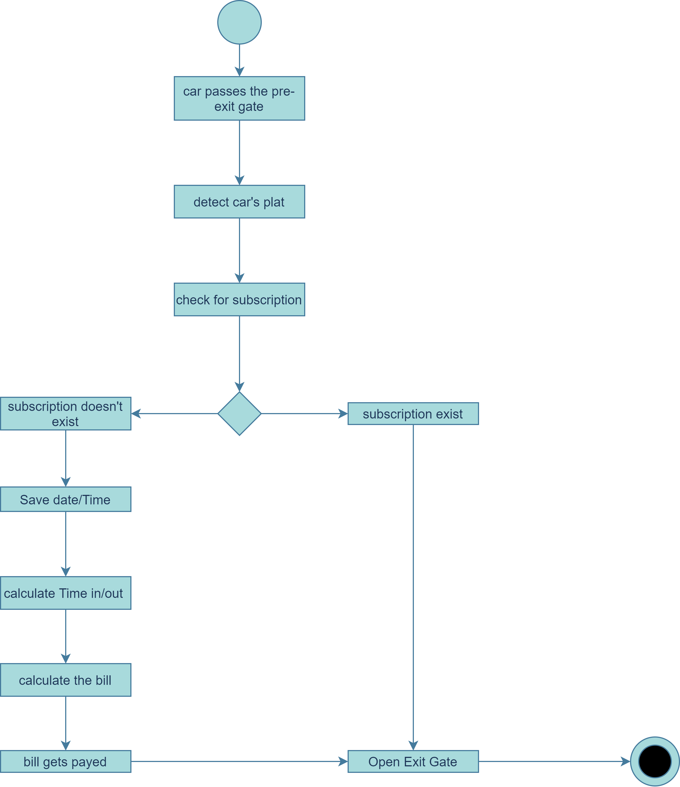
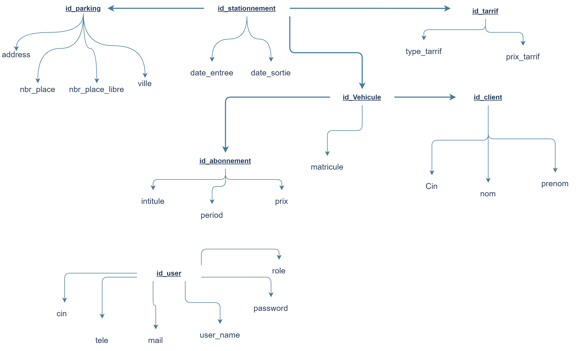
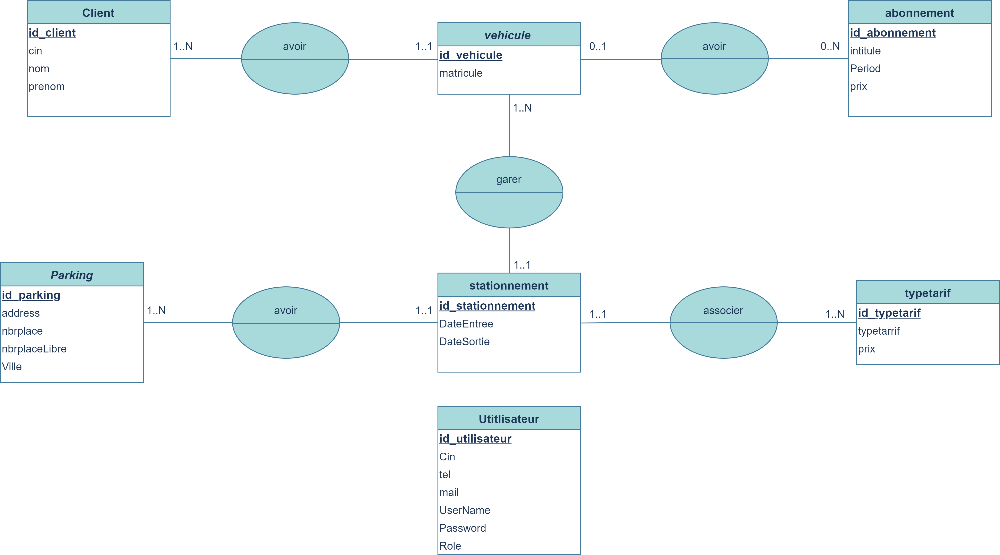
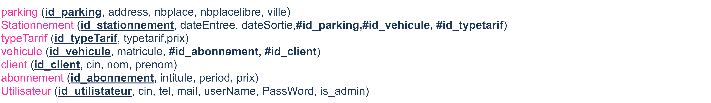

<!-- PROJECT LOGO -->
 

  
  

   Automated Parking Management System
  

    
  
<!-- TABLE OF CONTENTS -->

  
Table of Contents:

  <ol>
    <li>
      <a href="#about-the-project">About The Project</a>
      <ul>
      <li><a href="#conception">Conception</a></li>
        <li><a href="#built-with">Built With</a></li>
      </ul>
    </li>
    <li>
      <a href="#getting-started">Getting Started</a>
      <ul>
        <li><a href="#prerequisites">Prerequisites</a></li>
      </ul>
    </li>
  </ol>

<!-- ABOUT THE PROJECT -->
## About The Project

<b>Automated Parking Management System (APMS)</b>, is a fully automated plat detection system.
capable of:
  - detecting cars plat (using OpenCV).
  - managing parking transactions.
  - controlling the gates system.
  - controlling the billing system.

### Conception
- Class diagram (Diagramme de classes) 
  
  
- Entrance State diagram (Diagramme états-transitions) 
  
  
- Exit State diagram (Diagramme états-transitions) 
  

- Functional dependency diagram ( Diagramme de Dépendance fonctionnelle) 
  

- conceptual data model (Modèle conceptuel de données) 
  

- logical data model (modèle logique des données / simplified) 
  

### Built With
* [JavaFX ](https://openjfx.io/)
* [Maven](https://maven.apache.org/)
* [JFoenix](http://www.jfoenix.com/)

<!-- GETTING STARTED -->
## Getting Started

### Prerequisites

* [Java SE - Downloads | Oracle Technology Network | Oracle](https://www.oracle.com/java/technologies/javase-downloads.html)
*  [JFoenix](http://www.jfoenix.com/)
